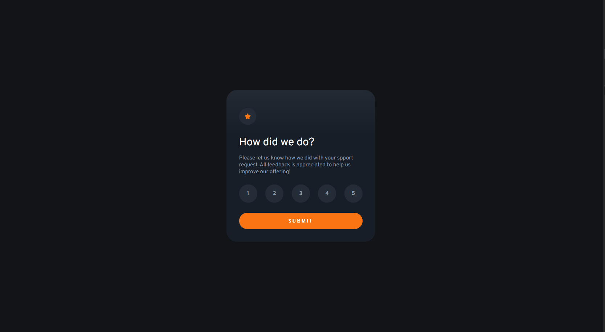
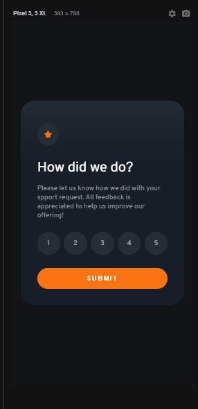

# Frontend Mentor | Interactive Rating Component

## Tabela do Conteudo

<ul>
<li><a href="#sobre">Sobre</a></li>
<li><a href="#status">Status</a></li>
<li><a href="#objetivo">Objetivo</a></li>
<li><a href="#curiosidade">Curiosidade</a></li>
<li><a href="#tecnologias">Tecnologias</a></li>
<li><a href="#acessando-o-site">Acessando o site</a></li>
</ul>

## Sobre

### Resolução do desafio do [Frontend Mentor](https://www.frontendmentor.io/challenges/interactive-rating-component-koxpeBUmI) para praticar o tratamento das interações do usuário e a manipulação do DOM.

### Layout Desktop / Mobile

## Status

Desafio concluido 👌

## Objetivo

Utilizar apenas o JavaScript puro, para fazer a captura das opções de avaliação e alternar para a próxima `section` de agradecimento no mesmo código HTML.

## Curiosidade

Esse desafio me permitiu praticar meus conhecimentos em JavaScript para resolver esse tipo de desafio.

## Tecnologias

<ul>
<li>HTML</li>
<li>CSS</li>
<li>JavaScript</li>
<li>GIT</li>
</ul>

## Acessando o site

Para acessar o site do desafio Interactive Rating Component, por favor use esse link: <a href="https://tiago-forward.github.io/desafio-interactive-rating-component/" target="_blank">Desafio Interactive Rating Component</a>